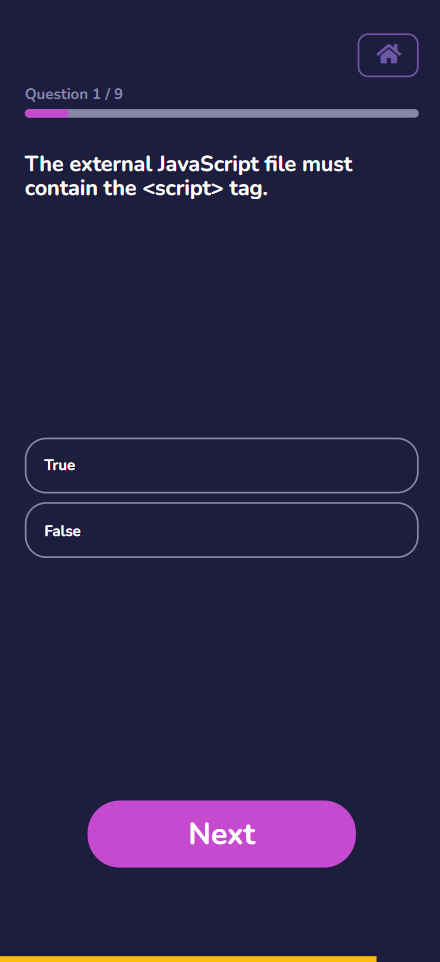

# Dev Quiz

## Introduction

This is a school project that I made.
We had to make a development quiz were we had to fetch questions from an API.

## Feature Overview

-   You can select which theme and amount of questions you get

-   Timer

-   Score page
    -   You can see how many you got right.
    -   You see the correct answer of the question you had wrong.

## Author

This was created by **Thibault Feraux**.

## Screenshots

    
    
    

